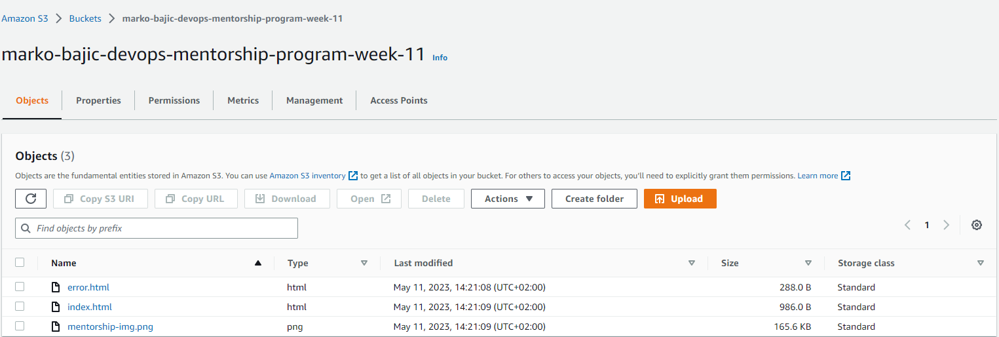
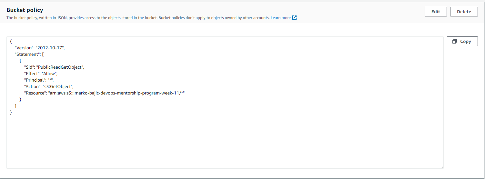
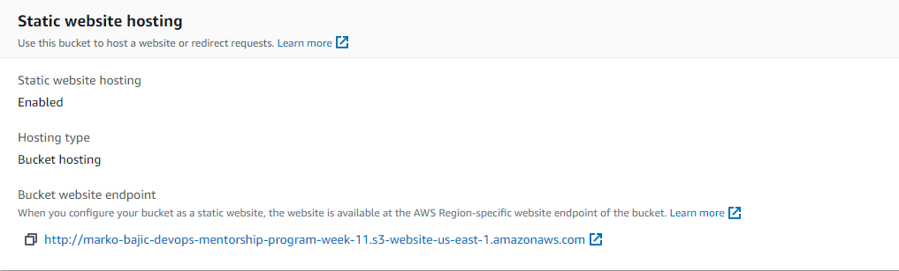
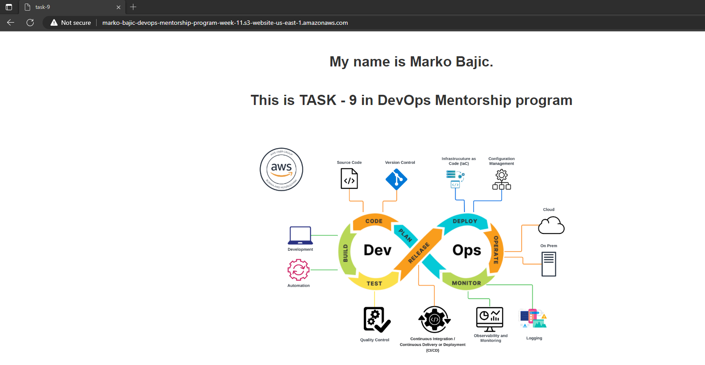
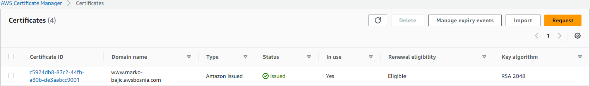
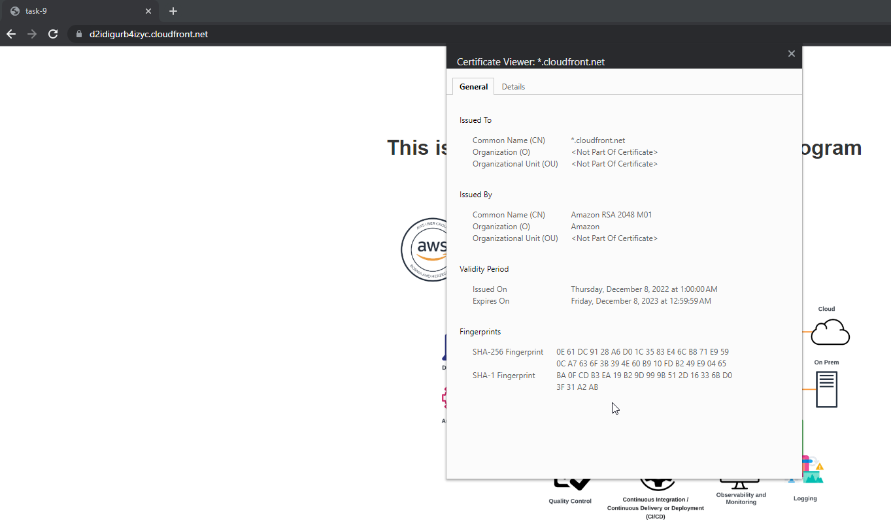
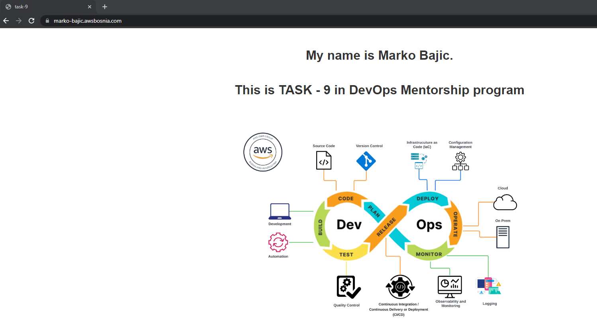

TASK-9: Static website with S3 and CloudFront

Zadatak 1

U tasku 9 je zadatak napraviti:
-.html file koji ce prikazivati Vaše ime i prezime, kratki Vaš opis, te DevOps image koji koristimo od početka programa. HTML file uredite kako god želite (text, colors, fonts, etc.), nije bitno, ali da je preglednost u najmanju ruku okey.

- Fajlovi index.html i error.html nalaze se u folderu HTML.

Zadatak 2

1. Kreirati S3 bucket u formatu: ime-prezime-devops-mentorship-program-week-11, te omogućiti static website:

Dodati .html i error.html file, Podesiti bucket na public access, te dodati bucket policy koji će omogućiti samo minimalne access permissions nad bucketom.

U AWS konzoli, kreirati S3 bucket na nacin:

- Bucket name - ime-prezime-devops-mentorship-program-week-11
- AWS Region - izaberete region u kojem zelite kreirati S3 bucket - eu-central-1
- Object ownership - ostaviti kako jeste ALS disabled
- Block all public access - odstrihirati kako bi bucket bio public i u warning prompt-u kliknuti na I acknowledge ...
- Bucket versioning - ostaviti Disable
- Tagovi
- Ostalo - defaultne postavke
- Create bucket

2. Na S3 Bucket

- Upload -> Add files i dodamo index.html, error.html i image za mentorship.
- Oznacimo dodane fajlove i Upload

3. Kreirani S3 

- Properties 
- Static website hosting - Edit -Enable
- Index document - index.html vas index fajl
- Error document - error.html dodati error fajl
- Save changes

4. Dodavanje Bucket policy -> Kreirani S3 Permissions

S3 website endpoint -> non encrypted
[S3 website endpoint](http://marko-bajic-devops-mentorship-program-week-11.s3-website-us-east-1.amazonaws.com/)

Prikaz website-a :

Zadatak 3

- Objava statičke web stranice kroz CloudFront distribuciju.
- Potrebno modifikovati:
    Origin domain, 
    Name, 
    Viewer protocol policy (Redirect HTTP to HTTPS), 
    Custom SSL certificate, 
    SSL certifikat koristimo od AWS Certificate Manager-a.

Prije kreiranja Cloud Front-a, potrebno je kreirati ACM certifikat

Napomena: ACM certifikat se kreira u regiji us-east-1 kada koristimo CloudFront

Koraci:

- ACM -> Request certificate ->
- Fully qualified domain name - www.marko-bajic.awsbosnia.com
- Validation method - DNS validation
- Key algorithm - RSA

Komanda za setovanje DNS recorda:

- # promijeniti www.marko-bajic.awsbosnia.com i CNAME VALUE (od kreiranov certifikata preko ACM)

aws route53 change-resource-record-sets --hosted-zone-id Z3LHP8UIUC8CDK --change-batch '{"Changes":[{"Action":"CREATE","ResourceRecordSet":{"Name":"CNAME -NAME","Typ
e":"CNAME","TTL":60,"ResourceRecords":[{"Value":"CNAME-VALUE"}]}}]}'

Kreiranje Cloud Front distrubucije

- Create Cloud Front distribution
    Origin domain - izaberemo s3 bucket
    Origin path preskocimo
    Name - default
    Origin access - public
    Default root object - index.html
    Viewer protocol policy- (Redirect HTTP to HTTPS)
    Settings - Custom SSL certificate - izaberemo kreirani Amazon certifikat

    Nakon kreiranja CloudFront distribucije, kopiramo distribution name u browser:

    

    Konfiguracija route53

    aws route53 change-resource-record-sets --hosted-zone-id Z3LHP8UIUC8CDK --change-batch '{"Changes":[{"Action":"CREATE","ResourceRecordSet":{"Name":"www.marko-bajic.awsbosnia.com","Type":"CNAME","TTL":60,"ResourceRecords":[{"Value":"d2idigurb4izyc.cloudfront.net"}]}}]}' 

    Kopiramo domenu u browser www.ime-prezime.awsbosnia.com

    

    
