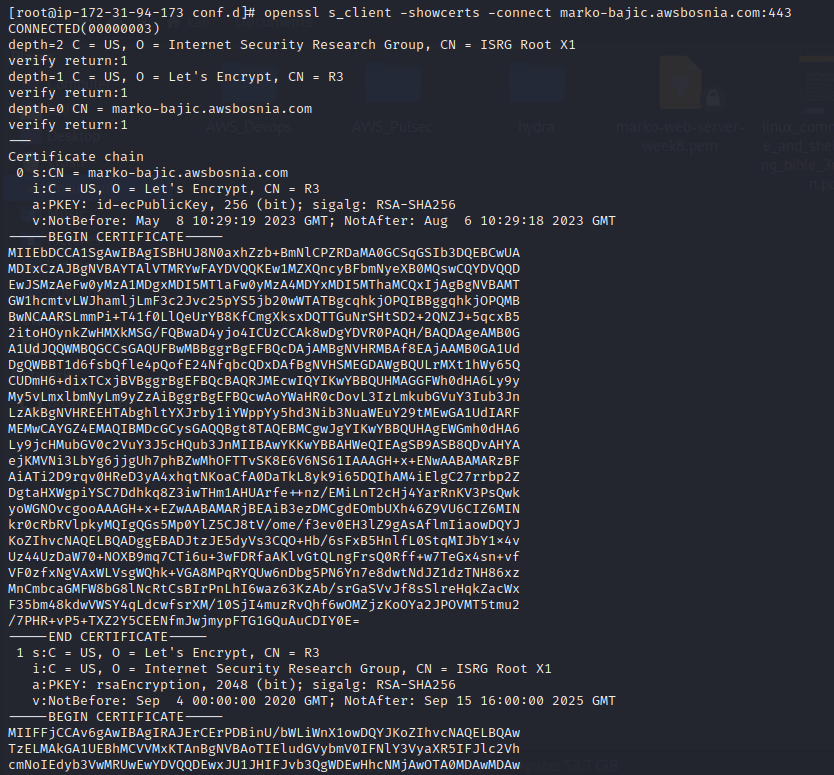
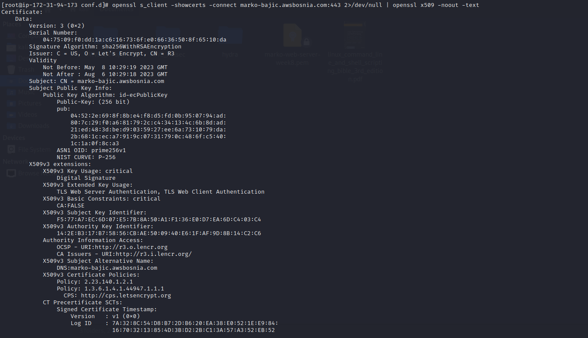
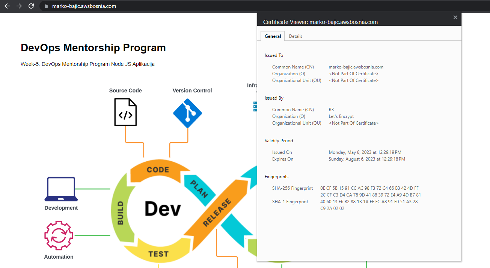
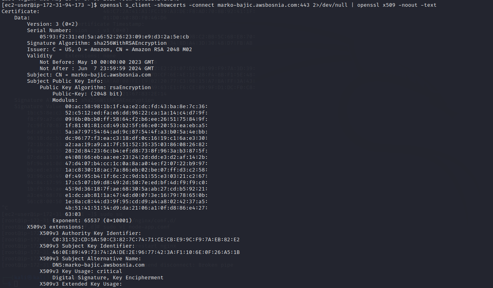

Week 9 - Homework / Task assigment

Kada smo iskoristi AMI za kreiranje ec2 instance na kojoj se nalazi nginx, nodejs app za ovaj task je bilo potrebno
kreirati  prvo Let's encrypt certifikate, a naknadno za ALB i certifikat koji je izdan od strane Amazona.

Korisni linkovi:

[Openssl_Git_dokumentacija](https://github.com/openssl/openssl)

[Certbot_tool_za_kreiranje_lets_encrypt_cert](https://certbot.eff.org/)

Prikazivanje SSL certifikata i datum isteka - openssl komanda

1. echo | openssl s_client -showcerts -servername marko-bajic.awsbosnia.com -connect marko-bajic.awsbosnia.com:443 2>/dev/null | openssl x509 -inform pem -noout -text

1. openssl s_client -showcerts -connect marko-bajic.awsbosnia.com:443

3. openssl s_client -showcerts -connect marko-bajic.awsbosnia.com:443 2>/dev/null | openssl x509 -noout -text

1. Prikaz detalja Let's encrypt certa

1. openssl s_client -showcerts -connect marko-bajic.awsbosnia.com:443 2>/de v/null | openssl x509 -noout -text

1. Prikaz detalja Amazon certa

